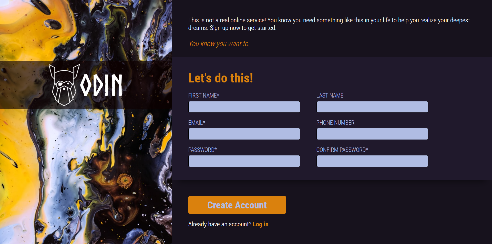

# odin-sign-up
It’s a sign-up form for an imaginary service

Solution for the [PROJECT: SIGN-UP FORM](https://www.theodinproject.com/paths/full-stack-javascript/courses/intermediate-html-and-css/lessons/sign-up-form) from the [Intermediate HTML and CSS](https://www.theodinproject.com/paths/full-stack-javascript/courses/intermediate-html-and-css) part of [The Odin Project](https://www.theodinproject.com/).
## Table of contents
- [Overview](#overview)
  - [Solution Screenshot](#solution-screenshot)
  - [Links](#links)
- [My process](#my-process)
  - [Built with](#built-with)
  - [What I learned](#what-i-learned)
- [Author](#author)

### Solution Screenshot
The final output:

### Links
Live Site URL: [Live site of the challenge hosted here](https://mainul-islam-nirob.github.io/odin-sign-up/)

## My process
Hello, this is my 5th project here in The Odin Project. It’s a sign-up form for an imaginary service. It has basic validation rules without using JavaScript.

### Built with
- Basic HTML5 markup
- Basic CSS
- FlexBox

### What I learned
How to validate form with only Html and CSS without using JavaScript

## Author
- Website - Well I haven't made my profile portfolio, gonna make it soon when I know a lot of stuffs.
- LinkedIn - [@mainul islam](https://www.linkedin.com/in/mainul-islam-nirob/)
- Frontend Mentor - [@mainul](https://www.frontendmentor.io/profile/Mainul-Islam-Nirob)
- Twitter - [@mainul](https://twitter.com/Mainuli96601040)
- FreeCodeCamp - [@mainul](https://www.freecodecamp.org/mainul)